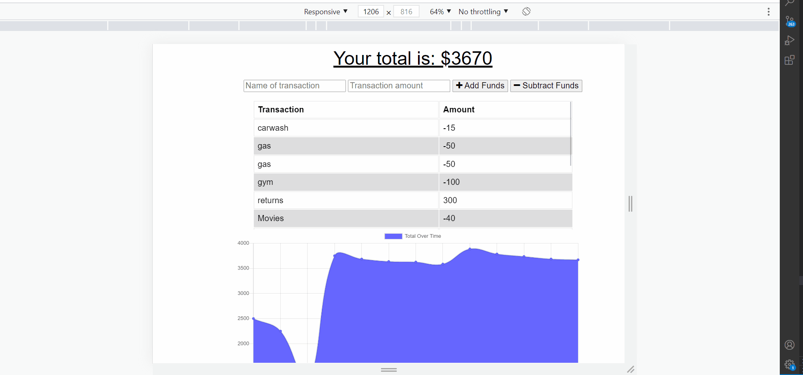

# Budget-Trackers

## Table of Contents
- [Description](#Description)
- [Installation](#Installation)
- [Usage](#Usage)
- [Contributing](#Contribution)
- [Tests](#Tests)
- [License](#License)
- [Contact](#Contact)
- [Link to Repository](#Repository)
- [Link to Deployed page](#Deployed)
    
## Description
An application that allows users to create and track daily Expenses. 
The application answers to the following user story and acceptance criteria:

### User Story

```md
AS AN avid traveller
I WANT to be able to track my withdrawals and deposits with or without a data/internet connection
SO THAT my account balance is accurate when I am traveling
```

### Acceptance Criteria

```md
GIVEN a user is on Budget App without an internet connection
WHEN the user inputs a withdrawal or deposit
THEN that will be shown on the page, and added to their transaction history when their connection is back online.
```

        
## Installation & Usage

Demo 



        
## Contribution
Mohamed Bassiouni
        
## Tests
NA.
        
## License
This project is licensed under the terms of the following license: 
    
[](https://opensource.org/licenses/MIT)
    
        
## Contact
GitHub: [MohamedB-01](https://github.com/MohamedB-01). 
    
For inquiries, please contact m.m.bassiouni@gmail.com.
    
## Link to Repository 
https://github.com/MohamedB-01/Budget-Trackers
    
## Link to Deployed page
